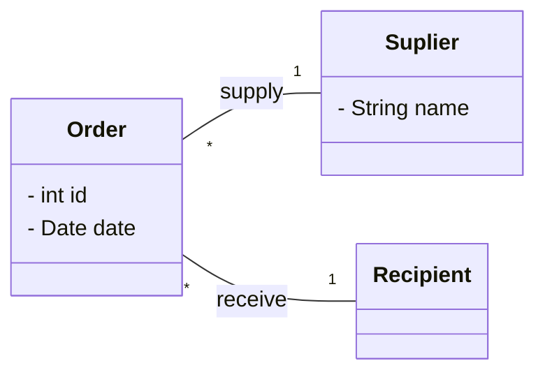

<h4 align="center">
  
  <a href="./.github/doc/kafka.md">Kafka</a>
</h4>
Application database first basée sur une base de données existante d'échange d'armes. Projet axé sur l'apprentissage de nouvelles technologies, avec un accent particulier sur l'exploration de React et une legere découverte de Kafka.

## Modèle de Données
Le modèle de données est représenté dans le diagramme de classe suivant :



## Web Client avec React
Le client web est développé en JavaScript avec la bibliothèque React et la bibliothèque Axios pour les requêtes Ajax. La navigation repose sur une pagination transparente avec défilement infini, exploitant la pagination de l'API.


## API REST
L'API REST offre les fonctionnalités suivantes :

| Endpoint           | Méthode | Opération | Description                |
| ------------------- | ------- | --------- | -------------------------- |
| /api/clients        | PUT     | add       | Ajouter un client          |
| /api/clients        | DELETE  | delete    | Supprimer un client        |
| /api/clients        | OPTIONS | help      | Liste des endpoints clients|
| /api/clients        | GET     | getAll    | Récupérer tous les clients |
| /api/clients/{name} | GET     | get       | Récupérer un client par nom |
| /api/orders         | PUT     | add       | Ajouter une commande        |
| /api/orders         | DELETE  | delete    | Supprimer une commande      |
| /api/orders         | OPTIONS | help      | Liste des endpoints commandes|
| /api/orders         | GET     | getAll    | Récupérer toutes les commandes |
| /api/orders/{name}  | GET     | get       | Récupérer une commande par nom |
| /api/products       | PUT     | add       | Ajouter un produit          |
| /api/products       | DELETE  | delete    | Supprimer un produit        |
| /api/products       | OPTIONS | help      | Liste des endpoints produits|
| /api/products       | GET     | getAll    | Récupérer tous les produits |
| /api/products/{name}| GET     | get       | Récupérer un produit par nom |

L'API suit les principes RESTful standard, avec les opérations CUD réalisées avec Kafka.

### Pagination
La pagination dans l'API REST propose différentes méthodes :

```bash
# Récupérer la page 0 implicitement
http://localhost:8080/server/api/products

# Récupérer la page 2
http://localhost:8080/server/api/clients?page=2

# Avec header
$ curl -d '{
          "page":1
        }' localhost:8080/server/api/clients
```

La pagination dans le client web est implémentée avec un défilement infini.

## JEE (Java Enterprise Edition)
Le serveur JEE utilise une base de données PostgreSQL comme source de données.

### Annotations
Des annotations personnalisées sont utilisées pour vérifier si un pays est soumis à un embargo. Les pays bloqués incluent l'Iran, la Corée du Nord, Cuba et la Syrie.

## Workflow
### GitHub Flow
Initialement, le [GitHub Flow](https://docs.github.com/en/get-started/using-github/github-flow), une variante du feature flow, a été choisi. Cependant, en raison des exigences changeantes du projet, un développement plus distribué a été adopté. Le workflow consiste en un grand nombre de commits, chacun étant modifié par le commit suivant. Cela offre un historique propre tout en restant accessible dans les reflogs.

```
$ git reflog
d7dd1cc HEAD@{0}: commit (amend): WIP: attempt to add container pushing
594c474 HEAD@{1}: commit (amend): WIP: mv dockerfile for server
07e93fc HEAD@{2}: commit (amend): WIP: add hot reload for client
d0faf88 HEAD@{3}: commit (amend): WIP: kafka
```

## CI/CD

Un début d'intégration et de livraison continues a été mis en place. Les actions sont lancées sur GitHub pour des raisons techniques. En effet, ma machine a tendance à planter fréquemment avec IntelliJ, et après avoir essayé d'utiliser un runner local, la situation s'est aggravée.
### Intégration Continue
Chaque commit depuis le début du projet est compilé avec Maven. De plus, depuis l'intégration avec Docker, un test d'intégration vérifie l'intégrité de l'API et la capacité du serveur et du client à se lancer.
### Livraison Continue
Pour simplifier les tests, les deux services du Docker Compose (le client et le serveur) sont téléchargés sur GHCR (GitHub Container Registry) à chaque push sur les branches "dev" et "main".
